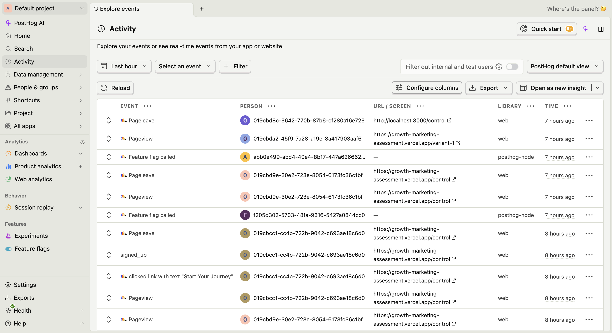
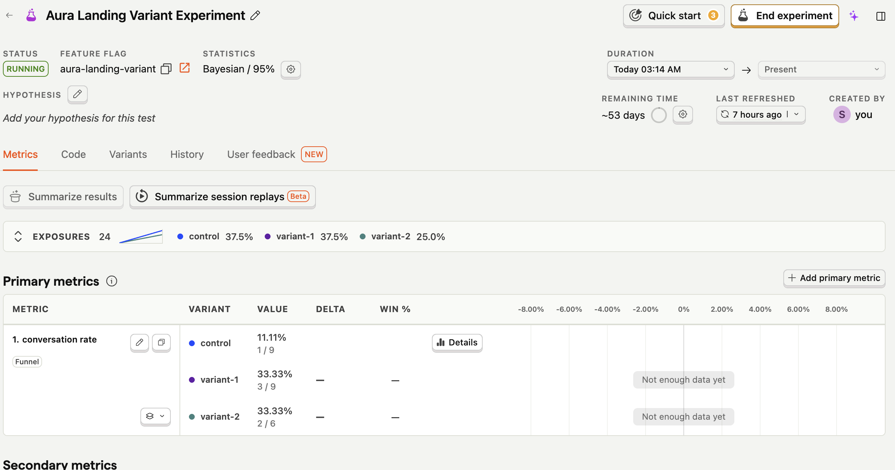

# Aura Wellness
This repository contains the technical implementation for the Aura Wellness landing page A/B test. It features three distinct variants built on a single, strictly DRY Next.js architecture, utilizing a centralized configuration pattern to render polymorphic components.

## Project Deliverables

- **Live Demos:**
  - [Control (Baseline)](https://growth-marketing-assessment.vercel.app/control)
  - [Variant 1 (Scarcity)](https://growth-marketing-assessment.vercel.app/variant-1)
  - [Variant 2 (Social Proof)](https://growth-marketing-assessment.vercel.app/variant-2)
- **Strategy & Hypotheses:** [Read the Hypothesis Document](./HYPOTHESIS.md)
- [Figma Design](https://www.figma.com/design/TzWInyJUYNPC1TtWvmVogy/Aura-Wellness-%E2%80%94-Landing-Page-Variants?node-id=59-2&t=q20AdLFWdjr5aKzZ-1)
- **Loom Videos:**
  - [Strategy Walkthrough](https://www.loom.com/share/bbcc4067ab47463b979a2909872b41dd)
  - [Technical Architecture Walkthrough](https://www.loom.com/share/e7646b4d19854e5a9ce2b29109e7bcc4)

## Tech Stack

- **Framework:** Next.js 16 (App Router)
- **Language:** TypeScript
- **Styling:** Tailwind CSS v4
- **Animation:** Framer Motion
- **Analytics & A/B Testing:** PostHog
- **Fonts:** Playfair Display (headings), DM Sans (body)

## Architectural Highlights

To satisfy the requirement of maintaining a single core layout/system without duplicating code, this project utilizes a **Centralized Configuration Architecture**.

1. **`src/lib/variants.ts`**: The single source of truth. It maps the URL routes (`/control`, `/variant-1`, `/variant-2`) to their specific copy, media assets, CTA labels, and deterministic referral codes. Shared constants (features, base stats, testimonials) are defined once and referenced across variants.
2. **Polymorphic Components**: Shared components (e.g., `<Features />`, `<SocialProof />`) accept a `config` prop and render the correct content for the current route. No variant-specific logic lives inside shared components.
3. **Variant-Specific Components**: Where a variant requires a structurally different section — not just different copy — a dedicated component is used (`<UrgencyBanner />`, `<FoundingOffer />`, `<UGCGrid />`, `<Variant1Hero />`). These are composed at the page level, keeping shared components clean.
4. **Variant Assignment**: The root `/` route reads or assigns a variant via `localStorage`, then immediately redirects. This keeps the experiment stable across page refreshes without server-side cookies.

## PostHog Tracking & CTA Logic

The primary conversion metric (`signed_up`) is handled by a custom `<CTAButton />` wrapper that ensures absolute data integrity:

**Live event stream (Activity feed):**



**A/B test experiment dashboard:**



- **Duplicate Prevention:** A `useRef` boolean flag ensures the PostHog event fires exactly once per click, even if the user clicks multiple times before the redirect completes.
- **Race-Condition Safety:** A 300ms `setTimeout` delay gives PostHog time to flush the event before `window.location.href` triggers the redirect.
- **Deterministic Routing:** Appends the exact `?referralCode=` defined in the variant config to the final redirect URL (`https://ads.axon.ai/auth/signup`).
- **Pageview Tracking:** The initial `$pageview` event is captured inside PostHog's `loaded` callback to guarantee the SDK is fully initialised before any event fires.

## Local Setup & Development

1. **Clone the repository:**
   ```bash
   git clone https://github.com/sierracheng/growth-marketing-assessment.git
   cd growth-marketing-assessment
   ```

2. **Install dependencies:**
   ```bash
   npm install
   ```

3. **Configure environment variables:**

   Create a `.env.local` file in the root directory:
   ```bash
   NEXT_PUBLIC_POSTHOG_KEY=your_posthog_project_api_key
   NEXT_PUBLIC_POSTHOG_HOST=https://us.i.posthog.com
   ```

4. **Run the development server:**
   ```bash
   npm run dev
   ```

   Open [http://localhost:3000](http://localhost:3000) to see the result. The root route will randomly assign a variant and redirect.

## Key Directory Structure

```
src/
├── app/
│   ├── page.tsx              # Variant assignment + redirect
│   ├── control/page.tsx      # Control variant page
│   ├── variant-1/page.tsx    # Variant 1 page
│   └── variant-2/page.tsx    # Variant 2 page
├── components/
│   ├── CTAButton.tsx         # Tracked CTA with dedup logic
│   ├── PostHogProvider.tsx   # PostHog initialisation + pageview tracking
│   ├── Navbar.tsx            # Shared navigation
│   ├── Hero.tsx              # Control hero
│   ├── Variant1Hero.tsx      # Variant 1 hero (scarcity/FOMO)
│   ├── Variant2Hero.tsx      # Variant 2 hero (social proof)
│   ├── Features.tsx          # Shared feature grid
│   ├── SocialProof.tsx       # Shared testimonials + stats
│   ├── UrgencyBanner.tsx     # Variant 1 fixed top banner
│   ├── FoundingOffer.tsx     # Variant 1 pricing card
│   ├── UGCGrid.tsx           # Variant 2 community photo/video grid
│   ├── EditorialFeatures.tsx # Shared Z-pattern editorial sections
│   ├── VoiceTestimonials.tsx # Variant 2 Web Speech API testimonials
│   └── Footer.tsx
└── lib/
    ├── variants.ts           # Centralized variant configuration (single source of truth)
    ├── experiment.ts         # localStorage-based variant assignment
    └── posthog.ts            # PostHog init + captureSignup helper
```
